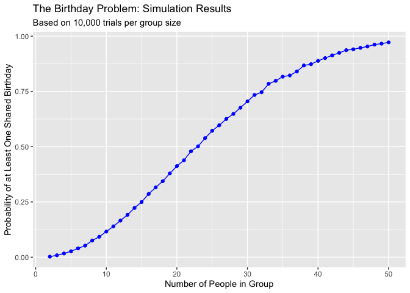
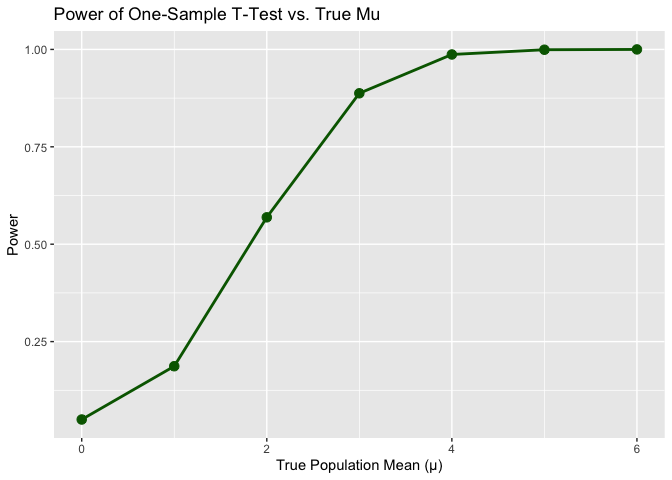

p8105_hw5_ab6168
================
Angelica Bailey
2025-11-05

``` r
library(tidyverse)
```

    ## ── Attaching core tidyverse packages ──────────────────────── tidyverse 2.0.0 ──
    ## ✔ dplyr     1.1.4     ✔ readr     2.1.5
    ## ✔ forcats   1.0.0     ✔ stringr   1.5.1
    ## ✔ ggplot2   3.5.2     ✔ tibble    3.3.0
    ## ✔ lubridate 1.9.4     ✔ tidyr     1.3.1
    ## ✔ purrr     1.1.0     
    ## ── Conflicts ────────────────────────────────────────── tidyverse_conflicts() ──
    ## ✖ dplyr::filter() masks stats::filter()
    ## ✖ dplyr::lag()    masks stats::lag()
    ## ℹ Use the conflicted package (<http://conflicted.r-lib.org/>) to force all conflicts to become errors

``` r
set.seed(1)
```

## Problem 1

Writing function:

``` r
#n: number of people in the group
#return true if at least two people share a birthday, false otherwise

birthday_match = function(n) {
  #randomly drawing n birthdays from 1 to 365
  birthdays = sample(1:365, size = n, replace = TRUE) 
  
  return(any(duplicated(birthdays)))
}
```

Creating data frame

``` r
simulation_results = data.frame(
  group_size = 2:50,
  probability = numeric(length(group_size)) #initialize column of zeros
)
```

Running simulations

``` r
for (i in 1:nrow(simulation_results)) {

  n = simulation_results$group_size[i] #getting group size n for the current row
  trials = replicate(10000, birthday_match(n)) 
  simulation_results$probability[i] = mean(trials) #calculating probability by finding the mean
}
```

Making plot

``` r
ggplot(simulation_results, aes(x = group_size, y = probability)) +
  geom_line(color = "blue") +
  geom_point(color = "blue") +
  labs(
    title = "The Birthday Problem: Simulation Results",
    subtitle = paste("Based on 10,000 trials per group size"),
    x = "Number of People in Group",
    y = "Probability of at Least One Shared Birthday"
  )
```

<!-- -->

Based on this plot, we can see that the probability of at least two
people in the group sharing a birthday steadily increases as the number
of people in the group increases and almost 100% chance when there are
50 people in a group.

## Problem 2

Setting design elements

``` r
n_sample = 30        
sigma = 5       
mu = c(0,1,2,3,4,5,6)     
n_sims = 5000
alpha_level = 0.05 

#function to save test output for each dataset
sim_mean_p = function(n, mu, sigma) {
  
  sim_data = rnorm(n = n, mean = mu, sd = sigma)
  result = t.test(sim_data, mu = 0)
  
  return(broom::tidy(result))
}

#iterating for 5000 datasets for each mu
sim_results = map_dfr(mu, function(mu_value) {
  sims_mu_value = map_dfr(1:n_sims, 
                          ~sim_mean_p(
                            n = n_sample,
                            mu = mu_value,
                            sigma = sigma
  )) |> 
    mutate(mu = mu_value)
  
}) |> 
  select(mu, estimate, p.value)
```

Make a plot showing the proportion of times the null was rejected (the
power of the test) on the y axis and the true value of 𝜇on the x axis.

``` r
#calculating power for each mu
power_results = sim_results |> 
  group_by(mu) |> 
  summarize(
    power = mean(p.value < alpha_level),
    .groups = "drop"
  )

ggplot(power_results, aes(x = mu, y = power)) +
  geom_line(linewidth = 1, color = "darkgreen") +
  geom_point(size = 3, color = "darkgreen") +
  labs(
    title = "Power of One-Sample T-Test vs. True Mu",
    x = "True Population Mean (μ)",
    y = "Power"
  )
```

<!-- --> The
plot shows a strong, positive association between effect size and power.
As $\mu$ increases, the power increases rapidly.The power increases
slowly at first (from $\mu=0$ to $\mu=1$), then very steeply (from
$\mu=1$ to $\mu=4$), and finally approaches 100% as the effect size
becomes very large.
